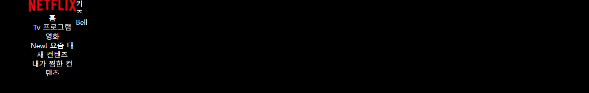
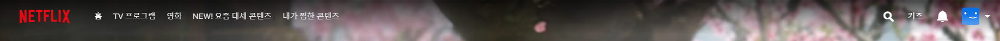
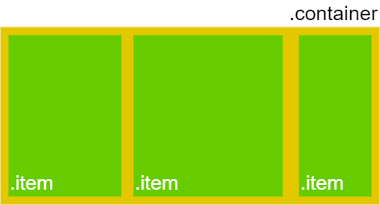

# 09.08 작업일지

  오늘은 기본적인 웹페이지를 구성하는 작업을 수행한다. 


# 09.09 작업 일지

웹 페이지를 구성할때, 사용되는 이미지는 대부분 `스프라이트`를 이용하여 구성하며, **스프라이트 이미지**란, 웹페이지에서 사용하는 여러개의 이미지를 하나의 이미지로 합쳐 놓은 것을 의미한다.

  스프라이트 이미지는 아래의 링크를 이용하여 구성할 수 있다.

https://www.toptal.com/developers/css/sprite-generator/


여기서 한가지 문제는, 화면이 제대로 출력되지 않는다는 것. 현재 상단 메뉴바를 만드는 과정에서 아래의 그림과 같이 한쪽으로 쏠리게 출력되는 것을 볼 수 있음



반면, 목적으로 하는  화면은 아래와 같음




  이 문제는,  `display`에 관한 문제가 존재하는 것으로 판단. 해당 내용에 대한 확인이 필요할 것으로 보임. 구성한 코드는 아래와 같음

```html
<!-- index.css -->
body{
    background-color: black;
    color: white;
    font-size: 14px;
}

header{
    padding: 0 60px;
    display: flex;
}

header #primary-menu{
    vertical-align: center;
    text-align: center;
    align-items: center;
    /*position: relative;*/
    padding-left: 0px;
    float: left;
    vertical-align: center;

}

header #primary-menu li a img{
    vertical-align: center;
}
header #secondary-menu{
    float: right;
}
header #primary-menu ul li{
    text-align: left;
    word-break: keep-all;
    /*display: inline;*/
}

<!--index.css-->
<body>
    <header>
        <ul id = "primary-menu">
            <li><a href="./index.html"></a></li>
            <li>홈</li>
            <li>Tv 프로그램</li>
            <li> 영화 </li>
            <li>New! 요즘 대새 컨텐츠</li>
            <li>내가 찜한 컨텐츠</li>
        </ul>
        <ul id = "secondary-menu">
            <li></li>
            <li>키즈</li>
            <li>Bell</li>
            <li id="user-icon"></li>
        </ul>

    </header>
```

> 위의 코드에서 문제점은, 내가 `height` 대신 widht를 지정한 것이 문제... 이 바보놈이


## display 속성

​	display 속성은 크게 

- block
- inline
- inline-block
- none
- flex
- gird
- inline-flex


### flex^[참고자료](https://studiomeal.com/archives/197)^

  **flex**는 레이아웃 배치 전용 기능으로 고안 되었으며, 레이아웃을 만들 때, 딱히 사용할게 없어서 쓰던 **float** 또는 **inline-block** 등을 이용한 <u>기존 방식보다 강력하고 편리한 기능</u> 제공

> **flex에 관한 오해,**
>
>   `grid`로도 `flex`로 구현 하는 것과 동일하게 구현할 수 있는 경우가 많지만, <u>grid로는 구현이 어려운 레이아웃이 **flex**를 쓸경우, 간단하게 해결 되는 경우가 존재</u>

​	

  flex의 기본 구조는 아래의 그림과 같다. 부모요소인 **div.container**를 **Flex Container(플렉스 컨테이너)**라 부르고, 자식 요소인 **div.itme**들을 **Flex Item(플렉스 아이템)**이라고 부르며,  간략히 정리하자면 <u>컨테이너</u>가 **flex**의 영향을 받는 **전체 공간**이며 설정된 속성에 따라 <u>각각의 아이템들이 어떤 형태로 배치되는것</u>이라고 생각하면 도움이 된다.



  **Flex**의 속성은 크게 **컨테이너에 적용하는 속성**과 **아이템에 적용하는 속성**으로 구분된다.

| 구분                          | 속성            | 설명                                                         |
| ----------------------------- | --------------- | ------------------------------------------------------------ |
| 컨테이너에 적용하는 속성      | display: flex   | flex 선언                                                    |
|                               | flex-direction  | 아이템 배치 방향 설정                                        |
|                               | flex-wrap       | 줄넘김 처리 설정                                             |
|                               | flex-flow       | **flex-direction**과 **flex-wrap**을 한꺼번에 지정할 수 있는 단축 속성 |
|                               | justify-content | 메인축 방향 정렬                                             |
|                               | align-items     | 메인 수직축 방향 정렬                                        |
|                               | align-content   | **flex-wrap: wrap**이 설정된 상태에서, 아이템들의 행이 2줄 이상되었을 때의 수직축 방향 정렬을 결정 |
| flex 아이템에 적용하는 속성들 | flex-basis      | flex 아이템의 기본 크기를 설정                               |
|                               | flex-grow       | **flex 아이템**이 <u>flex-basis</u>의 값보다 커질수 있는지 결정(0: false, 1 이상: true) |
|                               | flex-shrink     | **flow-grow**와는 반대로, <u>flex-basis</u>의 값보다 작아질수 있는지 결정 |
|                               | flex            | **flex-grow**, **flex-shrink**, **flex_basis**를 한번에 정의하는 축약형 |
|                               | align-self      | 수직축으로 아이템 정렬                                       |
|                               | order           | 아이템의 시작적 나열 순서 지정(스크린 리더를 사용할 경우 의미없음) |
|                               | z-index         | z축의 위치를 지정                                            |


위의 내용을 통하여, 내용을 수정하여, 아래와 같이 구성 하였다.


다만 아직 문제점이 남았는데, 먼저 우측에 들어가야할 `사용자 프로필`, `검색 아이콘` 등의 내용이 포함되지 않았으며, 각 태그의 클릭시 보일 기능 역시 미구연이다. 마지막으로, 해당 부분의 위치는 오른쪽으로 붙을 필요가 있다.

  또한 전체 헤드에는 그라데이션이 들어가야하며, 마우스 오버 시의 효과 역시 적용 시킬 필요가 있다.


  구성 및 변경한 내용은 아래와 같다. 가장 큰 변경 점은 `logo`라는 아이디를 가진 별도의 페이지를 구성한 것으로,  기 버전에서는 `primary-menu`와 `secondary-menu`로 구분하여 구성했던 것에서 변경을 하였다. 

```html

body{
    background-color: black;
    color: white;
    font-size: 14px;
}

header{
    padding: 0 60px;
    height: 70px;
    display: flex;
    position: relative;
    width: auto;
}
header #logo {
    margin: auto 0;
    margin-right: 25px;
}
header #primary-menu {
    display: flex;
    align-items: stretch;
    margin: auto 0;
    justify-content: space-around;
}

header #primary-menu li {
    align-items: center;
    justify-content: space-around;
    margin-right: 25px;
}
header #secondary-menu {
    /*align-self: end;*/
    align-items: center;
    align-items: stretch;
    display: flex;
    margin: auto 0;
}

header #secondary-menu li {
    align-items: center;
    justify-content: space-around;
    margin-right: 20px;
}

<body>
    <header>
        <ui id  = "logo">
            <li><a href="./index.html"></a></li>
        </ui>
        <ul id = "primary-menu">
<!--            <li><a href="./index.html"></a></li>-->
            <li>홈</li>
            <li>Tv 프로그램</li>
            <li> 영화 </li>
            <li>NEW! 요즘 대새 컨텐츠</li>
            <li>내가 찜한 컨텐츠</li>
        </ul>
        <ul id = "secondary-menu">
            <li></li>
            <li>키즈</li>
            <li>Bell</li>
            <li id="user-icon"></li>
        </ul>

    </header>

</body>
```


  이전 코드의 문제점은, `primary-menu`와 `secondary-menu`의 정렬 시 높이가 맞지 않는 문제점이 존재한다는 것으로, 이는 이미지의 크기로 인하여 발생하는 계산 오류일 것으로 판단된다. 

 이를 해결하기 위하여 netflix 로고를 출력하는 별도의 태그를 구성하였다.


## `secondary-menu` 우측 정렬 문제

  위의문제를 해결하는 방법은 생각 외로 간단했는데, `margin-left` 속성을 **auto**로 구성함으로서 해결 하였다.

 변경된 코드는 아래와 같다.

```css
header #secondary-menu {
    align-items: center;
    align-items: stretch;
    display: flex;
    margin: auto 0;
    margin-left: auto;
}
```

 이를 적용한 화면은 아래와 같다.


